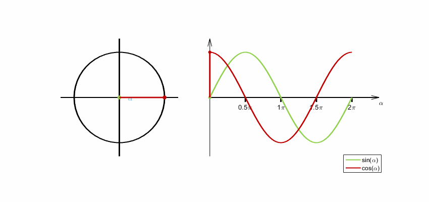

# Trigonométrie

## Rappels de trigonométrie

- **Le cercle trigonométrique**:

  - Définition et propriétés. ([link](https://www.geogebra.org/m/aavMVjyK))
  - Les fonctions trigonométriques (sinus, cosinus, tangente) associées aux angles.
  - Représentation graphique des fonctions trigonométriques.

    

## Applications en graphiques

- **Mouvements circulaires**: Utilisation du sinus et du cosinus pour créer des animations de rotation (roues, planètes, etc.).
- **Oscillations**: Modélisation de phénomènes oscillatoires (pendule, ressort) à l'aide des fonctions sinusoïdales.
- **Trigonométrie dans le triangle rectangle**: Résolution de problèmes de géométrie (calcul de longueurs, d'angles) à l'aide des relations trigonométriques.
- **Applications en jeux vidéo**: Calcul de distances entre objets, détection de collisions, etc.

## Exercices pratiques

- Dessin de spirales, de formes complexes basées sur des fonctions trigonométriques
